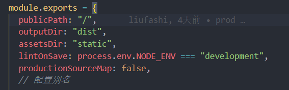

## 项目部署

如何将项目部署到云服务器上?前端的项目通常是将项目打包后的静态资源文件放到服务端代码的根目录中，详细请参考[个人项目部署至云服务器](./%E4%B8%AA%E4%BA%BA%E9%A1%B9%E7%9B%AE%E9%83%A8%E7%BD%B2%E8%87%B3%E4%BA%91%E6%9C%8D%E5%8A%A1%E5%99%A8.md)。但是个人用户购买的云服务器的带宽通常只有 1M~2M。若是生成的资源文件体积过大会导致加载缓慢。
下面是我自己在项目优化过程中的一点经验。

## 打包体积优化

### 不生成 map 文件

去掉打包生成的.map 文件，以 vue 项目为例，设置 vue.config.js 中的`productionSourceMap:false`，运行·`yarn build`后发现不会生成的.map 了。解释一下.map 就可以像未加密的代码一样，准确的输出是哪一行哪一列有错。 项目打包后，代码都是经过压缩加密的，如果没有.map 文件运行时报错，输出的错误信息无法准确得知是哪里的代码报错。


### 使用 gzip
使用compression-webpack-plugin插件，`yarn add compression-webpack-plugin -D`，按如下配置
```javascript
const CompressionWebpackPlugin = require("compression-webpack-plugin");
//...
module.exports = {
  configureWebpack: (config) => {
    if (process.env.NODE_ENV === "production") {
      config.plugins.push(
        new CompressionWebpackPlugin({
          filename: "[path].gz[query]", //3.0以上版本使用fileName，低版本为assets
          algorithm: "gzip",
          test: /\.(js|css)$/,
          threshold: 10240, // 达到10kb的静态文件进行压缩 按字节计算
          minRatio: 0.8, // 只有压缩率比这个值小的资源才会被处理
          deleteOriginalAssets: false, // 是否删除压缩的源文件
        }),
      );
    }
  },
};
//...
```
此时再运行build后可以看到生成的文件中多了以.gz后缀名的文件。这个时候还需要在云服务器上的nginx配置`vim /etc/nginx/nginx.conf`中开启gzip。配置可以直接拿去用。
```bash
    #开启gzip
    gzip on;
    #不压缩临界值，大于1K的才压缩
    gzip_min_length 1k;
    gzip_buffers 4 16k;
    #用了反向代理的话，末端通信是HTTP/1.0,默认是HTTP/1.1
    #gzip_http_version 1.0;
    #压缩级别，1-10，数字越大压缩的越好，开启与不开启差别较大，开启了之后1~9影响不明显。建设设置为4或者5
    gzip_comp_level 5;
    #进行压缩的文件类型JavaScript有两种写法，最好都写上吧，总有人抱怨js文件没有压缩，其实多写一种格式application/javascript 就行了
    gzip_types text/plain application/javascript application/x-javascript text/css application/xml text/javascript application/x-httpd-php image/jpeg image/gif image/png;
    #跟Squid等缓存服务有关，on的话会在Header里增加"Vary: Accept-Encoding"
    gzip_vary off;
    #IE6对Gzip不怎么友好，不给它开Gzip了
    gzip_disable "MSIE [1-6]\.";
```
配置完成后检查配置`nginx -t`（不使用是重载配置也会有错误提示）提示成功后重新载入配置`nginx -s reload`。
